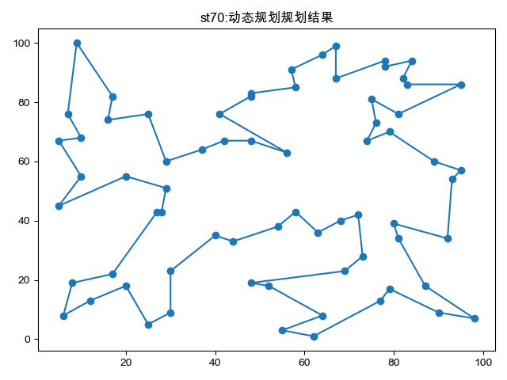
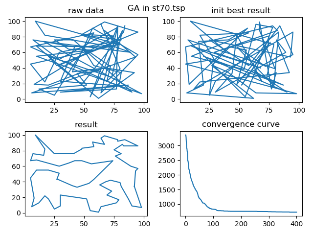
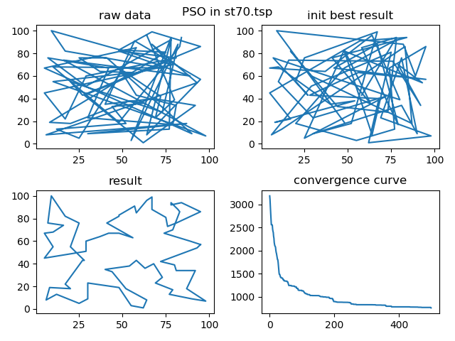
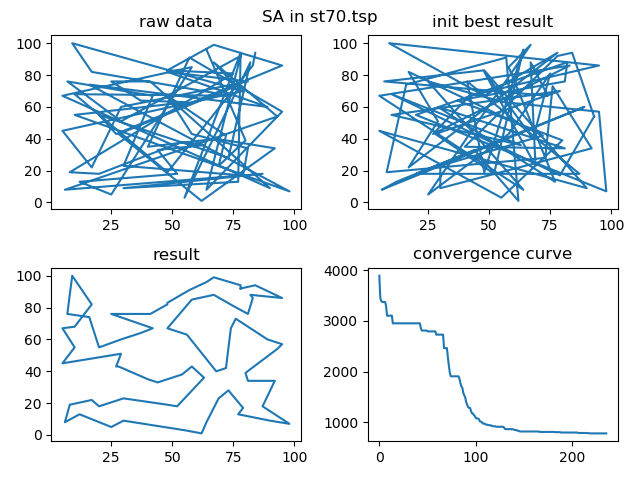
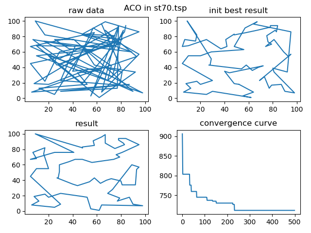
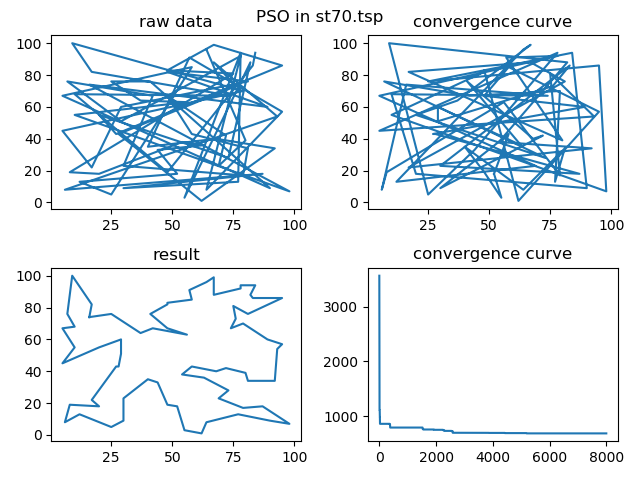
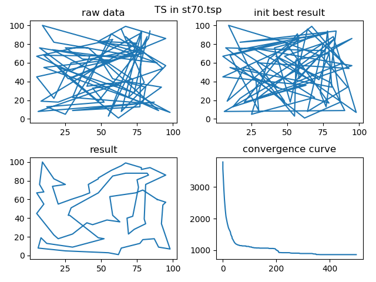

# Introduction
复现了一些TSP问题的相关算法，对TSP数据集st70.tsp进行了测试，并对此测试数据调整了参数，开箱即用。
# Algorithms
- [x] 动态规划(DP)
- [x] 遗传算法(GA)
- [x] 粒子群算法(PSO)
- [x] 模拟退火算法(SA)
- [x] 蚁群算法(ACO)
- [x] 自适应神经网络(SOM)
- [x] 禁忌搜索算法(TS)
- [ ] 指针网络(Pointer-network)[pytorch版本复现]
# Tips
1. 遗传算法核心要素：父代集合的数量，选择两个父代个体的方式，交叉操作、变异操作
2. 粒子群算法核心要素：个体当前最优与粒子群群体当前最优，生成新个体的时候与这两个最优解都会发生交叉
3. 模拟退火算法核心要素：跳出最优解的概率必须是会随着时间变化，降温速度，初始温度，最终温度，随机解的生成方式，随季解数量
4. 蚁群算法核心要素：不同城市之间的概率转移矩阵不断变化（受信息素的影响），参数繁多
5. 自适应神经网络核心要素：获胜神经元的定义方式，获胜领域的大小，竞争型神经网络，常用于聚类方法
6. 禁忌搜索算法核心要素：禁忌表长度，产生随机解的方式，本实现中为两两交换枚举（大规模节点不适用）
# Results
动态规划

遗传算法  

粒子群算法  

模拟退火算法  

蚁群算法  

自适应神经网络  

禁忌搜索  

# TODO
如果你有什么其他想要实现的算法没有完成，或者基于上述算法有一些改进方案并愿意开源，请push分支或者给我相关代码我进行复现~感谢~
# refrence
[SMO复现代码](https://github.com/DiegoVicen/som-tsp)